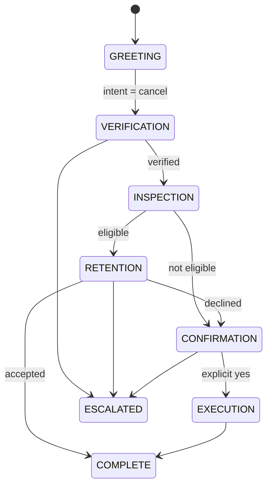

# Diagrams

Mermaid or ASCII, committed as markdown so they diff in version control. Avoid binary image formats — a diagram you cannot diff is a diagram that goes stale.

## Expected diagrams

| File | Day |
|---|---|
| `cancellation-workflow.md` | 5 — the seven-stage state machine, including unhappy paths |
| `golf-club-context.md` | 8 — system context and integrations |
| `pattern-decision-tree.md` | 15 — annotated with your own experience |
| `factory-pipeline.md` | 17 — spec → validate → generate → assemble → test |
| `trace-anatomy.md` | 13 — what a full trace contains |

## Example

````markdown

````

Include unhappy paths. A diagram showing only the happy path is a marketing asset, not a design.
