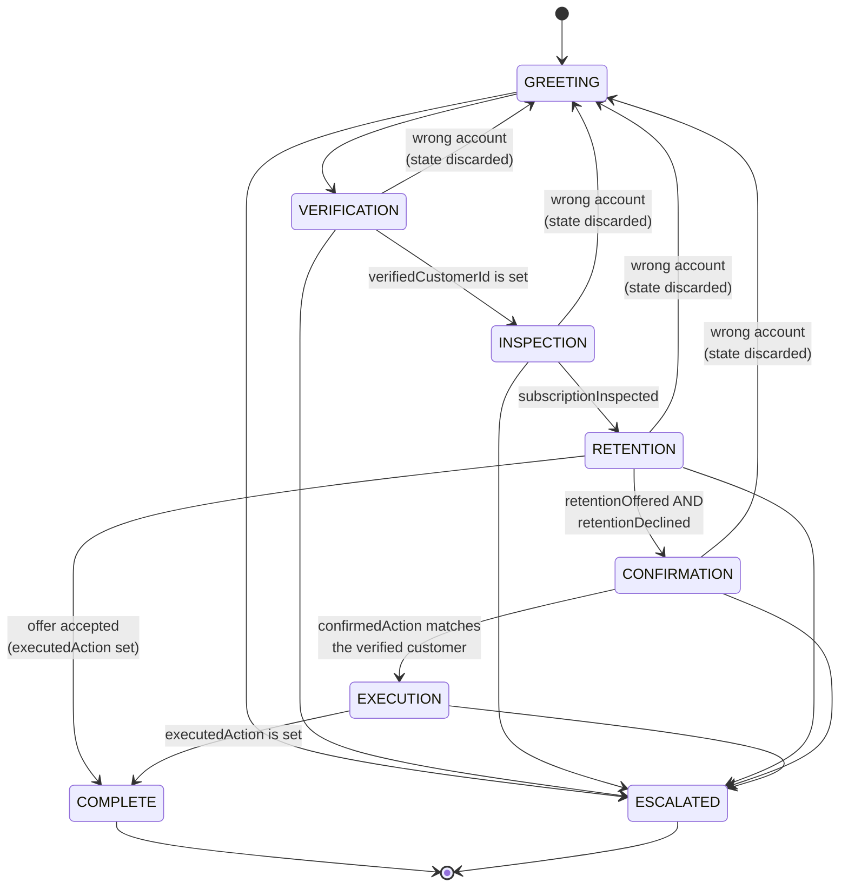

# Cancellation Workflow

The state machine in [`workflow.ts`](../../projects/01-hello-agent/src/workflow.ts), as built on day 5.

Every transition on this diagram is enforced by `canTransition()` and covered by a test in `workflow.test.ts`. Nothing here is guidance — the model has no say in any of it.

---

## The machine

---

## Tools by stage

The `tools` array is rebuilt from this table on **every** API call. A tool absent from the current stage does not exist as far as the model is concerned.

| Stage | Tools available | Why |
|---|---|---|
| `GREETING` | `verify_identity` | |
| `VERIFICATION` | `verify_identity` | Email **and** date of birth together. There is deliberately no separate lookup tool — one would confirm to a stranger whether an address belongs to a customer. |
| `INSPECTION` | `get_subscription` | Now account details may be disclosed. |
| `RETENTION` | `offer_retention`, `apply_retention` | One decision, on its own. Accepting is a valid ending. |
| `CONFIRMATION` | *(none)* | Conversation only. The agent describes the action and waits. |
| `EXECUTION` | `cancel_subscription` | **The only stage where the cancellation tool exists.** |
| `COMPLETE` | *(none)* | Done. |
| `ESCALATED` | *(none)* | A human has it. |

`escalate_to_human` is additionally available in **every** non-terminal stage. The agent must always be able to get a customer out.

---

## Preconditions, and where the evidence comes from

Each precondition is a field on `TaskState`. **Every one of them is written by code**, never by the model, and never from something the model claimed.

| Field | Written when | By |
|---|---|---|
| `verifiedCustomerId` | A supplied email **and** date of birth both matched | `verify_identity` — your code compares two values, down one code path |
| `subscriptionInspected` | `get_subscription` returned a row | The tool implementation |
| `retentionOffered` | `offer_retention` actually ran | The tool implementation |
| `retentionDeclined` | A user turn turned the offer down | A classifier answering one narrow question; the loop records it |
| `confirmedAction` | A user turn affirmed the action **currently on the table** | A classifier; the loop records it |
| `executedAction` | `cancel_subscription` **or** `apply_retention` actually ran | The tool implementation |

---

## What the unhappy paths are for

The forward path is the least interesting part of this diagram.

**Escalation** leaves from every non-terminal stage, has no preconditions, and is terminal.

A request for a human is detected by a small classifier rather than a regex — the regex it replaced caught 6 of 16 realistic phrasings and fired on *"are you a human?"*. The **main** model is never consulted, so it cannot offer to help first. Tone then decides the response, by rule:

| | |
|---|---|
| frustrated | straight through |
| neutral, first ask | the agent may offer to help once |
| neutral, asked again | straight through — nobody asks three times |

The agent can also escalate itself via `escalate_to_human`, from any stage.

**"Wrong account"** returns to `GREETING` **and discards `TaskState`**. This matters: if the state survived, the customer would remain verified as one person while discussing another's account. A backwards transition that doesn't clear evidence is worse than no backwards transition.

**No path skips a stage.** `GREETING → EXECUTION` isn't forbidden by a rule — it is absent from the map. Safety by omission is harder to get wrong than safety by prohibition.

---

## The bug this diagram would have caught

`EXECUTION → COMPLETE` originally had **no label** — no precondition.

That meant `COMPLETE` was reachable having cancelled nothing: on a run where the model spent its `EXECUTION` turn talking rather than calling the tool, the machine reported a completed cancellation against a live subscription.

Every other arrow had a condition. Drawing them out makes the empty one obvious in a way that reading the code did not.

`executedAction` is that missing label.

## The second bug it would have caught

`RETENTION` has **two** outgoing arrows — decline leads to `CONFIRMATION`, accepting leads straight to `COMPLETE`.

The code advancing stages was a linear map, one next stage per stage. It could not express a branch, so a customer who *accepted* the offer was stranded at `RETENTION` with the work already done.

A diagram makes a fork obvious. A `Record<Stage, Stage>` makes it unrepresentable.
