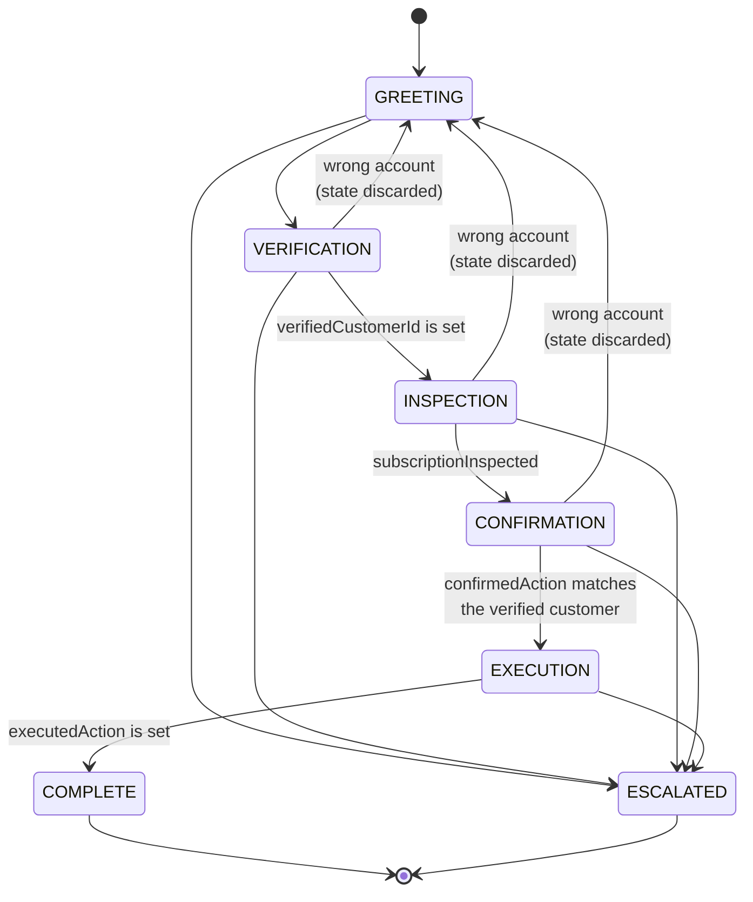

# Cancellation Workflow

The state machine in [`workflow.ts`](../../projects/01-hello-agent/src/workflow.ts), as built on day 5.

Every transition on this diagram is enforced by `canTransition()` and covered by a test in `workflow.test.ts`. Nothing here is guidance — the model has no say in any of it.

---

## The machine

---

## Tools by stage

The `tools` array is rebuilt from this table on **every** API call. A tool absent from the current stage does not exist as far as the model is concerned.

| Stage | Tools available | Why |
|---|---|---|
| `GREETING` | `find_customer` | Find the account. Returns ID and name only — never the date of birth. |
| `VERIFICATION` | `find_customer`, `verify_customer` | Prove who they are before anything else. |
| `INSPECTION` | `get_subscription` | Now account details may be disclosed. |
| `CONFIRMATION` | *(none)* | Conversation only. The agent describes the action and waits. |
| `EXECUTION` | `cancel_subscription` | **The only stage where the write tool exists.** |
| `COMPLETE` | *(none)* | Done. |
| `ESCALATED` | *(none)* | A human has it. |

---

## Preconditions, and where the evidence comes from

Each precondition is a field on `TaskState`. **Every one of them is written by code**, never by the model, and never from something the model claimed.

| Field | Written when | By |
|---|---|---|
| `verifiedCustomerId` | A supplied date of birth matched the record | `verify_customer` — your code compares two strings |
| `subscriptionInspected` | `get_subscription` returned a row | The tool implementation |
| `confirmedAction` | A user turn affirmed the action **currently on the table** | The loop, from a user message |
| `executedAction` | `cancel_subscription` actually ran and returned | The tool implementation |

---

## What the unhappy paths are for

The forward path is the least interesting part of this diagram.

**Escalation** leaves from every non-terminal stage, has no preconditions, and is terminal. In the code it is honoured *without calling the model at all* — a request for a human is not something the agent gets a view on.

**"Wrong account"** returns to `GREETING` **and discards `TaskState`**. This matters: if the state survived, the customer would remain verified as one person while discussing another's account. A backwards transition that doesn't clear evidence is worse than no backwards transition.

**No path skips a stage.** `GREETING → EXECUTION` isn't forbidden by a rule — it is absent from the map. Safety by omission is harder to get wrong than safety by prohibition.

---

## The bug this diagram would have caught

`EXECUTION → COMPLETE` originally had **no label** — no precondition.

That meant `COMPLETE` was reachable having cancelled nothing: on a run where the model spent its `EXECUTION` turn talking rather than calling the tool, the machine reported a completed cancellation against a live subscription.

Every other arrow had a condition. Drawing them out makes the empty one obvious in a way that reading the code did not.

`executedAction` is that missing label.
